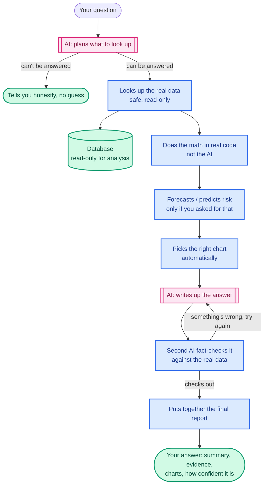

<div align="center">

# AI Business Intelligence Analyst

**Ask a business question in plain English. Get a real, checked answer — never a guess.**

[](https://www.python.org/)
[](https://github.com/langchain-ai/langgraph)
[](https://fastapi.tiangolo.com/)
[](https://www.postgresql.org/)
[](https://aibia-frontend.onrender.com)


*You type a question like "why did revenue drop in July?" A team of AI agents plans what data to look up, runs the numbers in real code (not guesswork), and a second AI double-checks the answer before you ever see it — rejecting it and trying again if something doesn't add up.*

</div>

---

## Try it live

- **App**: **[aibia-frontend.onrender.com](https://aibia-frontend.onrender.com)** — create a free account (any email/password) and ask it a question
- **API docs**: [aibia-api.onrender.com/docs](https://aibia-api.onrender.com/docs)

This runs on a free hosting plan, so if nobody's used it in a while, the first page can take **30–60 seconds** to wake up. If it looks stuck, just wait a bit and refresh.

**Good first questions to try:**
- *"Why did revenue decrease in July?"*
- *"How many customers do we have per region?"*
- *"What are our top 5 products by revenue?"*
- *"Forecast revenue for next month."*
- *"Which customers are at risk of churning?"*

---

## What it does

You ask a question in normal English — no need to know how the database is organized. Behind the scenes:

1. **It plans.** An AI figures out what data is needed to answer you — or tells you honestly it can't answer if the question isn't something the data can cover.
2. **It gets real numbers.** It runs safe, read-only database queries and does the actual math in regular code (pandas, the same tool a data analyst would use) — **the AI never does the arithmetic itself.**
3. **It checks its own work.** A second AI ("the Critic") independently re-checks whether the answer actually matches the data. If something looks made up or inconsistent, it's sent back to be redone — up to a couple of tries — before you ever see it.

The math, the chart, and the final "is this actually correct" check are never left to guesswork. **The AI plans and writes the words; everything else is real code that either gets the right answer or says so.**

---

## Why this is more trustworthy than a typical AI chatbot

A lot of "AI that answers your data questions" tools just ask a language model to look at some numbers and describe them — which means the model can also just make numbers up, and you'd never know. This project is built specifically to avoid that.

| What we do | Why it matters |
|---|---|
| **The AI never calculates anything itself** | Every number in a report comes from real Python code running over real database rows — not the AI "doing math in its head," which language models are known to get wrong. |
| **The database itself won't allow changes** | Even if something went wrong upstream, the database connection used for analysis is physically not allowed to write, edit, or delete anything — only read. |
| **A second AI fact-checks the first one** | Before you see an answer, a separate check re-verifies every number against the real data and rejects anything unsupported. |
| **It says "I don't know" instead of guessing** | If a question can't be answered from the real data, it says so plainly instead of inventing something plausible-sounding. |
| **Every claim is testable, not just trusted** | There's a whole automated test suite (more below) that keeps proving this stays true every time the code changes. |

---

## How it works, visually



*Pink = an AI is involved. Blue = plain, deterministic code with no AI (and no room for it to make things up). The AI only ever plans and writes words — it never touches the math or the final check.*

---

## Does it actually work? (the proof, not just a claim)

Instead of just saying "trust me," this project has an automated testing system that checks its own honesty every time the code changes — including deliberately trying to trick it (feeding it a fake number or an unsupported claim) to make sure the fact-checking step actually catches it.

| What was checked | Result | What it means |
|---|---|---|
| Full automated test suite | **569 out of 570 passed** | The 1 "failure" wasn't a real bug — it was a test that needs a live AI provider, and that provider's free daily usage limit was reached at that moment. Handled honestly, not hidden. |
| Fact-checking step actually catches lies | ✅ Passed | When a fake number or an unsupported claim was deliberately slipped into a report, the fact-checker caught it every time. |
| Revenue forecast accuracy | ~11% average error | Well inside the 25% error limit it's required to stay under |
| Churn (customer-loss) prediction accuracy | ~82% | Well above the 65% minimum it's required to clear |
| Full browser test (real clicking, real login) | **5 out of 5 passed** | Simulates an actual person using the site in a real browser |

Full technical detail on how these numbers are produced: [docs/evaluation.md](docs/evaluation.md).

### More things that were checked

| Check | What it answers |
|---|---|
| Can someone submit dangerous database commands through the chat box? | No — tried multiple attack styles, all blocked |
| Does the site correctly reject people who aren't logged in? | Yes — verified |
| Can one user see another user's private analyses? | No — verified, including running many people's requests at the same time |
| Does the "is the server healthy" check actually work? | Yes — fixed a real bug this round where it always said "healthy" even when the database was down |
| Does it ever leak a password or API key in logs or error messages? | No — checked across logs, error messages, and crash reports |

---

## The forecasting and prediction feature

Some questions ask about the future — *"forecast next month's revenue"* or *"who's likely to churn?"* For those, a dedicated piece of code (not an AI) does the actual prediction:

| Question type | How it predicts | What's used to check it |
|---|---|---|
| Revenue forecast | A trend line based on past months | Never tested on the future data it's predicting — only ever trained on the past |
| Customer churn risk | A standard statistics model over each customer's order history | Never shown the answer key (e.g. "did they actually leave") while learning the pattern |

**Honest limitation:** the forecast is a simple trend line — it won't know about an upcoming sale or a one-off event. And when it says a customer is "at risk," that's a statistical pattern, not proof of *why* — the system is specifically built to never claim it knows the cause, only the pattern.

---

## Built with

| Part | Tool |
|---|---|
| AI orchestration | LangGraph — coordinates the different AI/code steps |
| AI models | Anthropic Claude or Groq — swappable, whichever you have a key for |
| Backend | FastAPI (Python) |
| Database | PostgreSQL |
| Data analysis | pandas, NumPy — plain code, not AI |
| Prediction/forecasting | scikit-learn |
| Frontend | Streamlit |
| Login system | JWT tokens + encrypted passwords (bcrypt) |
| Testing | pytest (570+ automated tests) + Playwright (real-browser testing) |
| Hosting | Docker (to run it yourself) or Render (where the live demo runs) |

---

## How the data is organized

One database, three separate areas, each with different access rules:

| Area | Who can access it | What's in it | Purpose |
|---|---|---|---|
| `app` | Read/write, backend only | User accounts, saved analyses, reports, charts | This is where the app keeps its own records. **The AI never touches this area** — it's not data the AI analyzes, it's the app's own bookkeeping. |
| `analytics` | **Read-only** | A realistic fictional company's data: regions, customers, products, orders, payments, marketing campaigns | The main dataset — has a deliberate, known revenue dip built in so the "why did revenue drop" demo question always has a real, checkable answer. |
| `olist` | **Read-only** | A real Brazilian e-commerce dataset (~1.3 million rows): orders, products, sellers, reviews | Used for messier, more realistic demo questions. |

The AI's database connection is **physically only allowed to read** the `analytics` and `olist` areas — it cannot write, edit, or delete anything, no matter what. That's enforced by the database itself, not just by application code, so even a bug or a clever prompt can't get around it.

---

## The API, if you want to build on top of it

Everything goes through a REST API at `/api/v1`. The two-step flow is: **submit a question, then check back for the answer** (it takes a few seconds to a minute to think, so you don't wait on one long request).

| What you can do | Endpoint |
|---|---|
| Create an account | `POST /auth/register` |
| Log in (get an access token) | `POST /auth/login` |
| Ask a question | `POST /analyze` (needs your login token) |
| Check if it's done yet | `GET /analysis/{id}/status` |
| Get the finished report | `GET /analysis/{id}/report` |
| Get the charts | `GET /analysis/{id}/charts` |
| See your past reports | `GET /reports` |
| Check if the server is healthy | `GET /health` and `/health/ready` |

You always get back **your own** data only — never another user's. Full interactive docs (where you can try every endpoint in your browser) are at `/docs` once it's running — locally that's `http://localhost:8010/docs`, or live at [aibia-api.onrender.com/docs](https://aibia-api.onrender.com/docs).

---

## Run it yourself

**Easiest way — Docker (one command brings up everything):**
```bash
cp .env.example .env      # paste in one AI provider key
docker compose up --build
```
Then open **http://localhost:8511** for the app, or **http://localhost:8010/docs** for the raw API.

First time only — set up the database and load sample data:
```bash
docker compose exec api alembic upgrade head
docker compose exec api python scripts/generate_data.py
docker compose exec api python scripts/seed_database.py
```

**Without Docker:**
```bash
python -m venv .venv && . .venv/Scripts/activate      # or: source .venv/bin/activate
pip install -r requirements.txt
cp .env.example .env
alembic upgrade head
python scripts/generate_data.py
python scripts/seed_database.py
uvicorn app.main:app --reload
```

**Just want to run the tests, no AI key needed at all:**
```bash
docker compose exec api python -m pytest tests/ -q \
  --deselect tests/agents/test_critic_live_llm.py \
  --deselect tests/agents/test_report_agent_live_llm.py \
  --deselect tests/api/test_analyze_live_llm.py \
  --deselect tests/api/test_evaluation.py
```

Full environment variable list: [`.env.example`](.env.example). Deploying your own copy to Render: [docs/deployment.md](docs/deployment.md).

---

## What this project is — and isn't

Being upfront about the edges, instead of hiding them:

- **It's a portfolio/demo project**, not a certified enterprise product. The main dataset is realistic synthetic data (a fictional company), plus a real (but separate) e-commerce dataset for messier, more realistic questions.
- **The forecast is a simple trend line**, not a fancy predictive model — it won't see a sale or a one-off event coming. That's intentional, not a bug.
- **"At risk of churning" means a statistical pattern, not a proven reason** — the system is deliberately built to never claim it knows *why*, only *what pattern it saw*.
- **The free hosting has real free-tier limits**: the site can take up to a minute to wake up if it's been idle, the free database eventually expires (fine for a demo, not for anything permanent), and the AI provider has a daily usage cap that a heavy testing session can use up.
- **Login rate-limiting (blocking repeated wrong password attempts) only works on a single server** — if this were scaled to multiple servers, that protection would need to be rebuilt to work across all of them. Not done here on purpose, to keep things simple.
- **The optional "AI-polished narrative" wording is a bonus, not the real answer** — if it can't be verified against the real data, it's silently dropped, and you still get the real, fact-checked summary underneath.

---

## Want more detail?

This README keeps things high-level on purpose. The full technical write-ups live here:

| Doc | What's in it |
|---|---|
| [docs/architecture.md](docs/architecture.md) | How the pieces fit together, in depth |
| [docs/api.md](docs/api.md) | Every API endpoint, request/response shapes |
| [docs/security.md](docs/security.md) | Every security control, in detail |
| [docs/evaluation.md](docs/evaluation.md) | How the test scores and thresholds are calculated |
| [docs/deployment.md](docs/deployment.md) | How to deploy your own copy to Render |
