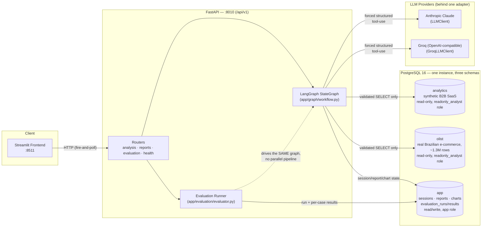
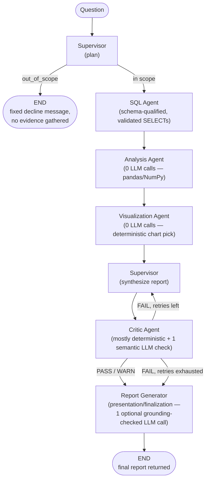

# AI Business Intelligence Analyst

A LangGraph-orchestrated, multi-agent system that turns a natural-language
business question into an evidence-traced, numerically-grounded,
critic-verified report — with charts, a bounded self-correction loop, and a
deterministic evaluation framework to measure all of it. Full original
design: [`BI_AGENT_BLUEPRINT_1.md`](BI_AGENT_BLUEPRINT_1.md). This file
tracks what's actually built.

> Ask "Why did revenue decrease in July?" and the system plans evidence to
> gather, runs safety-validated read-only SQL against real Postgres data,
> computes period/contribution/trend analysis in pandas (no LLM arithmetic),
> picks a chart type deterministically, synthesizes an answer, and has a
> Critic agent independently re-check every number and claim before it ever
> reaches you — rejecting and retrying its own output if something doesn't
> check out. A final Report Generator then presents the validated answer
> clearly (supporting evidence, a plain-language explanation, chart
> references) without ever re-deriving a fact itself.

---

## Status at a glance

| Component | State | Notes |
|---|---|---|
| Supervisor (plan + synthesize) | ✅ Done | LLM-backed, structured output, drives routing |
| SQL Agent | ✅ Done | Multi-schema, safety-validated, multi-step evidence gathering |
| Analysis Agent | ✅ Done | 0 LLM calls — deterministic pandas/NumPy |
| Visualization Agent | ✅ Done | 0 LLM calls — deterministic chart-type selection, 8 chart types |
| Critic Agent + retry loop | ✅ Done | Mostly deterministic checks + 1 isolated semantic LLM check |
| Evaluation framework | ✅ Done | 5-level scoring, mutation-tested Critic effectiveness, quota-safe |
| Report Generator | ✅ Done | Presentation/finalization layer after the Critic — deterministic-first, 1 optional grounding-checked LLM call |
| Streamlit frontend | ✅ Done | Pure HTTP client (`frontend/api_client.py`), bounded polling, honest progress checklist |
| Production hardening | ✅ Done | Error classification (`app/core/errors.py`), structured execution metadata, browser E2E (Playwright), quota-safe live tests |
| ML Agent (forecasting/churn) | ⛔ Not built | `app/agents/ml_agent.py` — stub, not wired into the graph |
| Auth / multi-user | ⛔ Not built | `User` table exists, no login flow |

**Two independent analytical datasets**, same safety pipeline, deliberately
never merged: `analytics` (synthetic B2B SaaS data with a known, reproducible
July 2026 Enterprise/North revenue dip — the eval ground truth) and `olist`
(real Brazilian e-commerce marketplace data, ~1.3M rows across 9 tables).

**LLM provider is swappable** (`LLM_PROVIDER=anthropic|groq`) behind one
adapter — every agent codes against `LLMClientProtocol`, never a vendor SDK
directly. Currently defaults to Groq in most local setups because Groq has a
generous free daily quota; Anthropic (Claude) is a one-line `.env` change.

---

## Architecture

### System



### Agent graph (LangGraph `StateGraph`, `app/graph/workflow.py`)



**Why a Critic loop, not just a better prompt:** the Supervisor's synthesis
is one LLM call trying to be accurate under instruction; the Critic is a
*second*, mostly non-LLM pass that mechanically re-derives whether the
output is actually consistent with the evidence — numeric grounding, chart/
analysis consistency, contribution arithmetic, causal-claim support — and
can force a bounded retry (`CRITIC_MAX_RETRIES`, default 2) rather than
silently shipping an ungrounded answer.

**Why a separate Report Generator, not just returning the Critic's input
as-is:** the Critic answers "is this trustworthy?"; the Report Generator
answers "how do we present it clearly?" — it never re-derives a fact, only
adds presentation-layer sections (supporting evidence, a plain-language
analysis explanation, chart references, technical detail) built verbatim
from state already validated upstream, plus one optional LLM wording pass
that gets re-checked against the same numeric-grounding rule the Critic
uses and silently discarded if it invents anything. A FAIL-exhausted report
still reaches it — presented honestly with its degraded confidence and
disclosed limitations intact, never spun to look better.

---

## Design principles that shape the code

- **The LLM plans and writes prose; it never computes.** Analysis Agent and
  ML Agent are contractually forbidden from importing `app/core/llm.py` —
  every number in a report traces back to pandas/NumPy arithmetic over real
  SQL rows, not something the model calculated in its head.
- **SQL safety is a real DB role, not just app-side validation.** The
  `readonly_analyst` Postgres role has no write/DDL grants at all — even a
  successful prompt-injection or validator bug can't mutate data. Everything
  in `app/tools/database_tools.py` (AST validation, allow-list, LIMIT clamp,
  audit log) exists to fail fast with a good error, not as the last line of
  defense.
- **Every LLM call is structured, forced tool-use — never free text parsed
  with regex.** `app/agents/schemas.py` Pydantic models define the contract
  on both the Anthropic and Groq side identically.
- **Ground truth lives in eval fixtures, never in application code.** The
  known July 2026 revenue dip that backs the benchmark is real seeded data,
  independently re-derivable by direct SQL — the app never special-cases it.
- **A provider quota outage is a recorded, honest state — not a hidden
  failure.** Both the live-LLM test suite and the evaluation runner catch
  `RateLimitError` specifically and report `SKIPPED_QUOTA`, distinct from an
  actual bug (`ERROR`).

---

## Tech stack

| Layer | Choice |
|---|---|
| Orchestration | LangGraph (`StateGraph`) + LangChain core |
| API | FastAPI + Uvicorn, async throughout |
| LLM | Anthropic Claude *or* Groq (OpenAI-compatible), one adapter, forced structured tool-use |
| Database | PostgreSQL 16 — one instance, three schemas (`app`, `analytics`, `olist`) |
| ORM / migrations | SQLAlchemy 2.0 (async) + Alembic |
| SQL parsing/validation | `sqlglot` (AST-level allow-list enforcement) |
| Analysis | pandas, NumPy — no LLM arithmetic |
| ML (forecast/churn) | scikit-learn baseline, XGBoost + SHAP where justified — **not yet built** |
| Visualization | Plotly (frontend rendering) + a deterministic Python chart-type selector |
| Frontend | Streamlit |
| Testing | pytest + pytest-asyncio, 383 tests, + a separate Playwright browser E2E suite |
| Ops | structlog (structured logging), python-dotenv |

---

## Repo map

| Path | What |
|---|---|
| `app/graph/state.py` | The single typed `AgentState` threaded through every node — its `trace` field *is* the audit log |
| `app/graph/workflow.py` | Graph wiring: `build_graph()` (current default), `build_phase0_graph()` (kept for one legacy test) |
| `app/agents/supervisor.py` | Plans evidence-gathering steps, then synthesizes the final report from gathered evidence |
| `app/agents/sql_agent.py` | Generates schema-qualified SQL per plan step, runs it through the safety pipeline |
| `app/agents/analysis_agent.py` | Deterministic pandas analysis over SQL results — **0 LLM calls** |
| `app/agents/visualization_agent.py` | Deterministic chart-type selection — **0 LLM calls**, spam-capped at 3 charts |
| `app/agents/critic.py` | Deterministic checks + one isolated semantic LLM check; drives the retry loop |
| `app/agents/report_agent.py` | Presentation/finalization layer, runs after the Critic — deterministic enrichments + 1 optional grounding-checked LLM narrative |
| `app/agents/ml_agent.py` | Stub — not implemented, not wired into the graph |
| `app/agents/schemas.py` | Pydantic models for every structured LLM call (`SupervisorPlan`, `SQLGeneration`, `SupervisorSynthesis`, `CriticSemanticCheck`) |
| `app/core/llm.py` | Provider-agnostic LLM adapter (`LLMClientProtocol`), forced tool-use, cumulative token-usage tracking |
| `app/core/config.py` | All settings, env-driven — see [Environment variables](#environment-variables) |
| `app/tools/database_tools.py` | SQL safety pipeline: AST validation, LIMIT injection, audit logging |
| `app/tools/schema_tools.py` | Multi-schema introspection + prompt formatting (`ALLOWED_SCHEMAS`) |
| `app/tools/analysis_tools.py` | `compare_periods`, `analyze_trend`, `analyze_contribution`, `top_n`, `distribution_stats`, `diagnose_decline` |
| `app/tools/column_classifier.py` | Heuristic period/dimension/metric detection from arbitrary SQL result shapes |
| `app/tools/chart_selector.py` | Deterministic chart-type selection → `VisualizationSpec` |
| `app/tools/critic_checks.py` | All deterministic Critic checks (numeric grounding, chart consistency, contribution arithmetic, causal-claim support, `values_are_close` tolerance rule) |
| `app/db/models.py` / `models_olist.py` | SQLAlchemy models — `app`/`analytics` schemas, and `olist` |
| `app/db/migrations/` | Alembic — includes the `readonly_analyst` role grants |
| `app/api/routes/` | FastAPI routers, mounted under `/api/v1` |
| `app/services/` | Business logic behind the routes (`analysis_service.py`, `evaluation_service.py`) — keeps routers thin |
| `app/evaluation/` | The full evaluation framework — see [below](#evaluation-framework) |
| `scripts/generate_data.py` / `seed_database.py` | Synthetic data generator + loader — bakes in the fixed July 2026 Enterprise/North dip |
| `scripts/load_olist.py` | Loads `data/raw/*.csv` (Kaggle Olist dataset, not committed) into `olist.*` |
| `scripts/run_evaluation.py` | CLI entry point for the evaluation runner |
| `tests/` | `unit/ integration/ agents/ api/ security/ evaluation/` — see [Testing](#testing) |
| `tests/fakes.py` | `ScriptedLLMClient` — the scripted-LLM test double every deterministic test uses |
| `docs/` | `architecture.md`, `security.md`, `api.md`, `evaluation.md` — implementation-tracking companions to the blueprint |
| `frontend/app.py` | Streamlit UI — submit a question, poll status, render the report + charts |

---

## Quick start (Docker)

```bash
cp .env.example .env      # fill in an API key — see Environment variables below
docker compose up --build
```

- API: http://localhost:8010/docs (interactive Swagger UI)
- Frontend: http://localhost:8511
- `GET /api/v1/health/ready` should report `"database": true` once Postgres is healthy.

(Host ports `8010`/`8511` instead of the usual `8000`/`8501` — avoids
clashing with other projects on this machine.)

Run migrations, then seed both schemas:

```bash
docker compose exec api alembic upgrade head

docker compose exec api python scripts/generate_data.py   # synthetic -> data/seeds/*.csv
docker compose exec api python scripts/seed_database.py   # -> analytics.*

# Olist: download the Kaggle "Brazilian E-Commerce Public Dataset by Olist"
# CSVs into data/raw/ yourself first (not committed — see .gitignore), then:
docker compose exec api python scripts/load_olist.py      # -> olist.*
```

## Quick start (local, no Docker)

```bash
python -m venv .venv && . .venv/Scripts/activate   # or source .venv/bin/activate
pip install -r requirements.txt
# start a local Postgres 16, matching .env's POSTGRES_* values
alembic upgrade head
python scripts/generate_data.py
python scripts/seed_database.py
uvicorn app.main:app --reload
```

---

## Environment variables

All settings are env-driven (`app/core/config.py`) — no hard-coded secrets or
hosts. `.env` is gitignored; only `.env.example` (no real values) is
committed.

| Variable | Default | Purpose |
|---|---|---|
| `DATABASE_URL` | — | App DB connection (read/write, `app` schema) — SQLAlchemy async |
| `ANALYTICS_DATABASE_URL` | — | Analytical DB connection, bound to the **read-only** `readonly_analyst` role |
| `READONLY_DB_USER` / `READONLY_DB_PASSWORD` | `readonly_analyst` | Credentials for the SQL-safety-layer DB role, provisioned by the Alembic migration |
| `SQL_ROW_LIMIT_DEFAULT` | `5000` | LIMIT clamp injected into every generated query |
| `SQL_STATEMENT_TIMEOUT_MS` | `8000` | Postgres `statement_timeout` for analytical queries |
| `LLM_PROVIDER` | `anthropic` | `anthropic` or `groq` — selects which client `get_llm_client()` builds |
| `ANTHROPIC_API_KEY` | *(empty)* | Required only if `LLM_PROVIDER=anthropic` |
| `LLM_MODEL_FAST` / `LLM_MODEL_STRONG` | `claude-haiku-4-5-20251001` / `claude-sonnet-5` | Anthropic model tiers |
| `GROQ_API_KEY` | *(empty)* | Required only if `LLM_PROVIDER=groq` — free key at console.groq.com |
| `GROQ_MODEL_FAST` / `GROQ_MODEL_STRONG` | `openai/gpt-oss-20b` / `openai/gpt-oss-120b` | Groq model tiers |
| `LLM_MAX_RETRIES` | `2` | Bounded exponential-backoff retries for transient (429/5xx) errors, passed straight into both SDK clients |
| `CRITIC_MAX_RETRIES` | `2` | Max Critic-forced synthesis retries before forcing confidence down to `Low` |
| `ENVIRONMENT` | `development` | — |
| `LOG_LEVEL` | `INFO` | structlog level |
| `API_HOST` / `API_PORT` | `0.0.0.0` / `8000` | Uvicorn bind (Docker maps container `8000` → host `8010`) |

**Groq quota note:** the free tier has a *daily* token quota (200,000 TPD as
observed). It's a real, external, non-code constraint — both the live test
suite and the evaluation runner detect `RateLimitError` specifically and
degrade gracefully (`pytest.skip()` / `status="SKIPPED_QUOTA"`) rather than
reporting a false failure.

---

## Database schema

One Postgres instance, three schemas, two different trust levels:

| Schema | Role | Tables | Purpose |
|---|---|---|---|
| `app` | read/write, app's own DB user | `users`, `analysis_sessions`, `analysis_steps`, `analysis_reports` (incl. Phase 10's `report_extras` JSONB), `charts`, `evaluation_runs`, `evaluation_results` | Session/report/eval state. **Never** touched by LLM-generated SQL. |
| `analytics` | **read-only**, `readonly_analyst` role | `regions`, `customers`, `products`, `orders`, `order_items`, `payments`, `marketing_campaigns`, `customer_activity` | Synthetic B2B SaaS data — deliberately deterministic, including a fixed July 2026 Enterprise/North revenue dip used as evaluation ground truth |
| `olist` | **read-only**, `readonly_analyst` role | 9 tables (customers, orders, order_items, products, reviews, sellers, geolocation, payments, category translation) | Real Brazilian e-commerce marketplace data (~1.3M rows), for realistic/messier demo questions — no FK constraints (unverified referential cleanliness of externally-sourced data) |

`analytics` and `olist` are deliberately **never merged** — no shared
`region`/`segment` concept exists in the real Olist data, and forcing one
would mean fabricating values the source data doesn't support.

---

## SQL safety pipeline

| # | Layer | Where |
|---|---|---|
| 1 | Read-only DB role — no write/DDL grants at all, SELECT-only on `analytics.*` and `olist.*` | Alembic migrations |
| 2 | AST validation (single `SELECT` statement, no disallowed node types) | `app/tools/database_tools.py::validate_sql` |
| 3 | Schema-qualified table/column allow-list, live-introspected (never agent-supplied) | `app/tools/schema_tools.py` |
| 4 | `LIMIT` injection/clamp | `database_tools.py::validate_sql` |
| 5 | `statement_timeout` + `READ ONLY` transaction | `app/db/database.py` |
| 6 | Audit log — query hash, table set, row count, duration (**never** the row data itself) | `database_tools.py::execute_validated_query` |

Layer 1 is the boundary that has to hold even if every other layer has a
bug. `tests/security/test_sql_injection.py` exercises stacked queries,
comment-obfuscated keywords, a write disguised as a CTE, and out-of-allow-
list table access — against the **live** `readonly_analyst` role, not mocked.

---

## Evaluation framework

Deterministic, quota-safe, and runs the **same production graph** the API
uses — not a second execution pipeline.

```
evaluation/datasets/benchmark.json   5 cases, real psql-verified ground truth
        │
app/evaluation/benchmark.py          load + validate cases
        │
app/evaluation/evaluator.py
    run_case_live(case)              runs app.graph.workflow.get_graph()
        │                            (RateLimitError -> SKIPPED_QUOTA, never hidden)
    evaluate_case_from_state(...)    pure, deterministic scoring
        │
app/evaluation/metrics.py            SQL / answer / analysis / visualization /
                                      critic correctness, groundedness,
                                      hallucination detection, critic
                                      effectiveness (mutation testing),
                                      report completeness (Phase 10)
        │
app/services/evaluation_service.py   persists EvaluationRun/EvaluationResult
        │
POST /api/v1/evaluation/run          fire-and-poll, same shape as POST /analyze
GET  /api/v1/evaluation/results
```

- **5 evaluation levels** per case (`sql`, `analysis`, `visualization`,
  `critic`, `end_to_end`) localize exactly where a failure happened —
  `app/evaluation/failure_analysis.py` buckets a whole run's failures by
  level, not just a dropped aggregate number.
- **Critic effectiveness is measured by mutation testing against the real
  Critic checks** — inject a fabricated number and an unsupported causal
  claim into a genuinely good report, verify the deterministic checks
  escalate the verdict. No LLM required, runs on every case.
- **Ground truth lives only in `evaluation/datasets/benchmark.json`**,
  independently re-verifiable via direct SQL — never referenced from
  application code.
- **Report completeness (Phase 10)** is an additive quality signal — does
  the finalized report actually carry its presentation-layer sections
  (verified claims, analysis explanation, visualizations, technical
  details)? Reported per case and in the run's aggregate scores, but
  deliberately **not** folded into a case's PASSED/FAILED status, so it
  can't silently change which of the 5 benchmark cases pass.
- **The optional LLM-judge** (relevance / recommendation-quality rubric,
  `app/evaluation/judges.py`) is isolated and **not** called by a default
  run — deterministic evaluation needs zero LLM budget.
- Run it: `docker compose exec api python -m scripts.run_evaluation`, or
  `POST /api/v1/evaluation/run` — writes a timestamped JSON report to
  `evaluation/reports/` either way, plus DB rows via the API path.

---

## API

Base path: `/api/v1`. Interactive docs at `/docs` once the API is running.
Fire-and-poll pattern throughout — no external queue: `POST` schedules a
background task and returns `202` immediately; poll `status` until
`DONE`/`FAILED`.

| Endpoint | Status |
|---|---|
| `GET /health` | ✅ |
| `GET /health/ready` | ✅ — checks DB connectivity, reports LLM provider/key presence |
| `POST /analyze` | ✅ — runs the full agent graph; returns `202 {analysis_id, status}` |
| `GET /analysis/{id}/status` | ✅ |
| `GET /analysis/{id}/report` | ✅ — `409` until `status == DONE` |
| `GET /analysis/{id}/charts` | ✅ — `[]` when no chart was warranted for the question |
| `GET /analysis/{id}` | ✅ — full session + trace (backs an "agent trace" view) |
| `GET /reports` | ✅ — cross-session listing |
| `POST /evaluation/run` | ✅ — fires a benchmark run, `202 {run_id, status}` |
| `GET /evaluation/results` | ✅ — filter by `run_id`, or list all runs |

---

## Testing

**383 tests** in the main suite (`docker compose exec api pytest tests/`),
plus a separate Playwright browser E2E suite (`tests/e2e/`, not part of
that run — needs a real browser). Unit-level tests never touch a live LLM;
a small, explicitly-named set of live tests make a real network call and
self-skip (not fail) without a configured provider key, and skip
gracefully — honestly classified as quota/rate-limit via
`app/core/errors.py`, never silently — if the provider is rate-limited at
run time.

| Directory | Count | What |
|---|---|---|
| `tests/unit/` | 131 | Pure logic — SQL validator, schema tools, analysis/ML tools, column classifier, chart selector, critic checks, LLM usage tracking, error classification, fake LLM provider |
| `tests/evaluation/` | 49 | Evaluation framework — metrics, evaluator, benchmark dataset, failure analysis |
| `tests/frontend/` | 72 | `frontend/`'s pure modules only (`api_client`/`polling`/`progress`/`report_view`/`chart_builder`/`health`) — no `streamlit` import anywhere in this directory |
| `tests/agents/` | 64 | Per-agent behavior with `ScriptedLLMClient`; `test_critic_live_llm.py` (2 tests) and `test_report_agent_live_llm.py` (1 test) are the live-LLM exceptions |
| `tests/api/` | 46 | Route/service-level status/validation/concurrency/observability; `test_analyze_live_llm.py` (1 test) and `test_evaluation.py` (2 tests, real benchmark run) make real LLM calls |
| `tests/integration/` | 11 | Full graph round trips against real seeded Postgres, scripted LLM |
| `tests/security/` | 9 | SQL injection / safety-boundary tests (live `readonly_analyst` role) + API error-response sanitization |
| `tests/e2e/` | 2 | Playwright, real browser + real frontend + real backend — deterministic via `LLM_PROVIDER=fake`, see `docs/architecture.md`'s Phase 13 section for setup |

```bash
docker compose exec api python -m pytest tests/ -q
```

Run just the fully-deterministic subset (zero live LLM calls, zero quota risk):

```bash
docker compose exec api python -m pytest tests/ -q \
  --deselect tests/agents/test_critic_live_llm.py \
  --deselect tests/agents/test_report_agent_live_llm.py \
  --deselect tests/api/test_analyze_live_llm.py \
  --deselect tests/api/test_evaluation.py
```

---

## Known limitations (not bugs)

- **Groq daily quota** is finite and shared across every live call in a
  session (app usage + live tests + live evaluation runs) — a full live
  benchmark run can exhaust it mid-run. Handled explicitly, not hidden.
- **Streamlit frontend styling is basic** — functional, not polished.
- **Dimension cardinality is capped at 50 groups** in `column_classifier.py`
  to keep charts/tables readable — a deliberate cap, not a bug.
- **Critic's causal/period-consistency checks are heuristic** (regex/keyword
  based), not full NLP — tuned against real observed failure modes, not
  formally verified.
- **Chart validation against raw evidence rows is limited** for the
  `table`/`scatter` fallback chart types, which read straight from SQL rows
  rather than a structured `analysis_results` entry.
- **ML Agent is not built** — no forecasting/churn prediction yet.
- **The Report Generator's LLM narrative is a bonus, not a guarantee** —
  it's discarded whenever it can't be verified against the same grounding
  check the Critic uses (an invented number, a call failure, or a quota
  exhaustion all degrade to the same `narrative: null`); the report's real
  content is always the deterministic `executive_summary`/`key_findings`
  the Critic already validated, narrative or not.

---

## Roadmap

Built, in order: walking skeleton → multi-schema SQL/schema tools →
Supervisor → SQL Agent → Analysis Agent → Visualization Agent → evaluation
framework → Critic Agent + retry loop → Report Generator → FastAPI
integration hardening → Streamlit frontend → production hardening (error
classification, structured execution observability, browser E2E, live-test
reliability). Not yet built: ML Agent (forecasting/churn), authentication.
