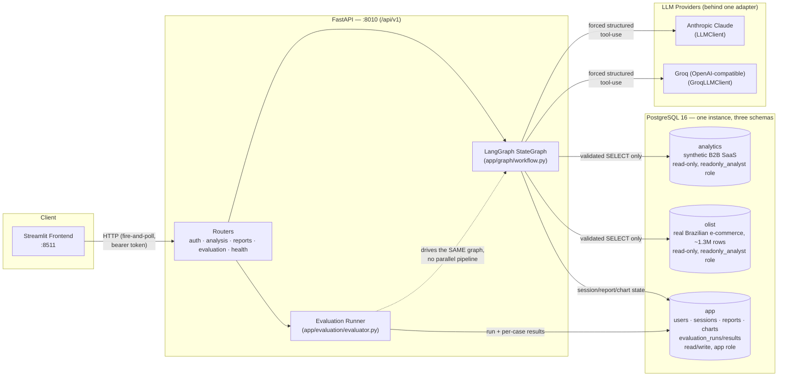
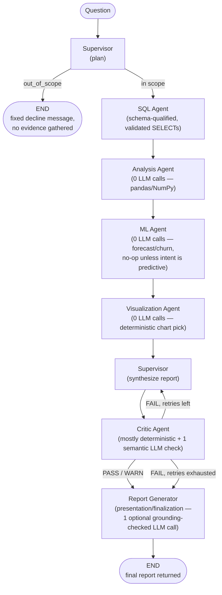
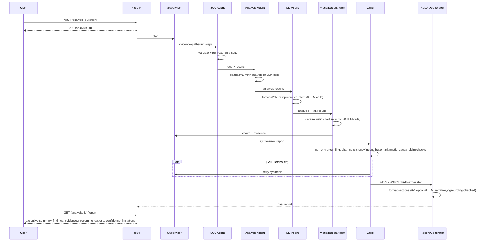
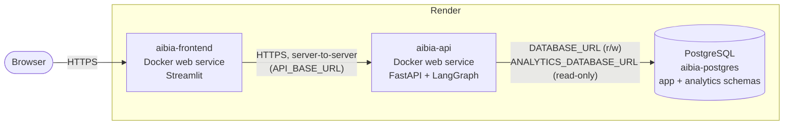

<div align="center">

# AI Business Intelligence Analyst

### Multi-agent, evidence-traced, self-correcting business analytics

An end-to-end agentic BI platform that turns a natural-language business
question into a numerically-grounded, critic-verified report — with charts,
a bounded self-correction loop, ML forecasting/churn risk, and a
deterministic evaluation framework to measure all of it.

[](https://www.python.org/)
[](https://github.com/langchain-ai/langgraph)
[](https://fastapi.tiangolo.com/)
[](https://www.postgresql.org/)
[](https://streamlit.io/)
[](https://www.docker.com/)
[](https://render.com/)
[](https://pytest.org/)

</div>

---

| Agents | Orchestration | Evaluation Levels | Test Suite |
| :---: | :---: | :---: | :---: |
| **7** | **LangGraph StateGraph** | **6** | **575 tests** |

| DB Schemas | SQL Safety Layers | ML Tasks | Auth |
| :---: | :---: | :---: | :---: |
| **3** | **6** | **forecast + churn** | **JWT + bcrypt** |

> **Scope note:** This is a research/portfolio engineering project demonstrating
> agentic BI patterns — evidence-traced analysis, self-correcting verification,
> and quality-gated ML — over a seeded synthetic dataset plus a real (but
> disconnected) e-commerce dataset. It is not a certified enterprise BI product
> and its ML forecasts are not investment or business advice.

**Navigate:** [Architecture](#architecture) | [Agent Workflow](#agent-workflow) |
[ML Agent](#ml-agent) | [Evaluation](#evaluation-framework) |
[Security](#security) | [Quick Start](#quick-start) | [Deployment](#deployment-render) |
[API](#api) | [Testing](#testing)

## What This Project Demonstrates

| Capability | Implementation |
| --- | --- |
| **Agentic orchestration** | 7-node LangGraph `StateGraph` (Supervisor → SQL → Analysis → ML → Visualization → Critic → Report), with a bounded self-correction retry loop |
| **SQL safety** | AST validation, live schema allow-list, LIMIT clamp, read-only DB role with no write/DDL grants, statement timeout, audit logging — 6 independent layers |
| **Deterministic analysis** | Period/contribution/trend/top-N computation in pandas/NumPy — **zero LLM arithmetic**, every number traces back to a real SQL row |
| **Self-verification** | A Critic agent independently re-derives whether the synthesized answer is actually consistent with the evidence, and can force a bounded retry rather than ship an ungrounded claim |
| **ML forecasting & churn risk** | Time-aware linear-trend revenue forecasting and stratified logistic-regression churn prediction, both leakage-audited and quality-gated |
| **Evaluation framework** | 7 benchmark cases scored across 6 levels (SQL, analysis, visualization, ML, critic, end-to-end), with mutation-tested Critic effectiveness — deterministic, quota-safe |
| **Production hardening** | JWT auth + bcrypt hashing, `SECRET_KEY` rotation, login rate limiting, error classification, structured execution metadata, browser E2E, Render deployment config |

## Architecture

### System



### Agent graph (LangGraph `StateGraph`, `app/graph/workflow.py`)



## Agent Workflow



**Why a Critic loop, not just a better prompt:** the Supervisor's synthesis
is one LLM call trying to be accurate under instruction; the Critic is a
*second*, mostly non-LLM pass that mechanically re-derives whether the
output is actually consistent with the evidence — numeric grounding, chart/
analysis consistency, contribution arithmetic, causal-claim support — and
can force a bounded retry (`CRITIC_MAX_RETRIES`, default 2) rather than
silently shipping an ungrounded answer.

**Why a separate Report Generator, not just returning the Critic's input
as-is:** the Critic answers "is this trustworthy?"; the Report Generator
answers "how do we present it clearly?" — it never re-derives a fact, only
adds presentation-layer sections (supporting evidence, a plain-language
analysis explanation, chart references, technical detail) built verbatim
from state already validated upstream, plus one optional LLM wording pass
that gets re-checked against the same numeric-grounding rule the Critic
uses and silently discarded if it invents anything. A FAIL-exhausted report
still reaches it — presented honestly with its degraded confidence and
disclosed limitations intact, never spun to look better.

## Design principles that shape the code

- **The LLM plans and writes prose; it never computes.** Analysis Agent and
  ML Agent are contractually forbidden from importing `app/core/llm.py` —
  every number in a report traces back to pandas/NumPy arithmetic over real
  SQL rows, not something the model calculated in its head.
- **SQL safety is a real DB role, not just app-side validation.** The
  `readonly_analyst` Postgres role has no write/DDL grants at all — even a
  successful prompt-injection or validator bug can't mutate data. Everything
  in `app/tools/database_tools.py` (AST validation, allow-list, LIMIT clamp,
  audit log) exists to fail fast with a good error, not as the last line of
  defense.
- **Every LLM call is structured, forced tool-use — never free text parsed
  with regex.** `app/agents/schemas.py` Pydantic models define the contract
  on both the Anthropic and Groq side identically.
- **Ground truth lives in eval fixtures, never in application code.** The
  known July 2026 revenue dip that backs the benchmark is real seeded data,
  independently re-derivable by direct SQL — the app never special-cases it.
- **A provider quota outage is a recorded, honest state — not a hidden
  failure.** Both the live-LLM test suite and the evaluation runner catch
  `RateLimitError` specifically and report `SKIPPED_QUOTA`, distinct from an
  actual bug (`ERROR`).

## ML Agent

`app/agents/ml_agent.py` runs in every graph execution (same "always in the
chain, no-op if not applicable" pattern as the other agents) but only does
real work when the Supervisor classified the question `intent ==
"predictive"`. Two tasks, chosen by keyword match — **zero LLM calls, zero
LLM quota** for either:

| Task | Method | Split | Trigger keywords |
| --- | --- | --- | --- |
| Revenue forecasting | Linear-trend baseline over monthly revenue | Time-aware (held-out points always the most recent — never shuffled) | "forecast", "predict", "next month/quarter/year", "trend" |
| Churn risk | Logistic regression over per-customer order-history features | Stratified random (legitimate — each customer row is independent, no time ordering) | "churn", "risk", "retention", "attrition", "at risk" |

### Quality gates (not a ceiling — a regression floor)

| Metric | Threshold | Observed baseline |
| --- | ---: | ---: |
| Forecast MAPE | ≤ 25% | ~11% |
| Forecast MAE | ≤ 20% of held-out mean | — |
| Churn ROC-AUC (primary) | ≥ 0.65 | ~0.82 |
| Churn accuracy | ≥ 0.60 | ~75% |
| Churn precision | ≥ 0.55 | ~76% |
| Churn recall | ≥ 0.55 | ~73% |

Both tasks reach the database exclusively through `app/tools/
database_tools.py::run_query` — the same AST validation/schema allow-list/
LIMIT clamp/readonly-role pipeline as every LLM-generated query, nothing ML
is exempt from it. A leakage audit confirmed the forecast's held-out tail
never leaks into the fitted model, and churn's label-derivation columns
(`churned`, `days_since_last_order`, `last_order_date`) are never among the
columns actually fed to the classifier — proven by regression tests, not
just asserted.

**Honest limitations:** the forecast is a simple linear trend — not
seasonal, not causal, won't anticipate promotions or one-off events. Churn
feature importance reflects statistical association in this dataset, not
proven cause; neither the model nor the synthesis prompt is permitted to
phrase it as causal, and the Critic rejects an ML-grounded causal claim the
same conservative way it rejects any unsupported one.

## Tech stack

| Layer | Choice |
| --- | --- |
| Orchestration | LangGraph (`StateGraph`) + LangChain core |
| API | FastAPI + Uvicorn, async throughout |
| LLM | Anthropic Claude *or* Groq (OpenAI-compatible), one adapter, forced structured tool-use |
| Database | PostgreSQL 16 — one instance, three schemas (`app`, `analytics`, `olist`) |
| ORM / migrations | SQLAlchemy 2.0 (async) + Alembic |
| SQL parsing/validation | `sqlglot` (AST-level allow-list enforcement) |
| Analysis | pandas, NumPy — no LLM arithmetic |
| ML (forecast/churn) | scikit-learn (`LogisticRegression`, fixed `random_state=42`) |
| Visualization | Plotly (frontend rendering) + a deterministic Python chart-type selector |
| Frontend | Streamlit |
| Auth | PyJWT (bearer tokens, `kid`-based dual-key rotation) + bcrypt |
| Testing | pytest + pytest-asyncio (575 tests) + Playwright (browser E2E) |
| Deployment | Docker Compose (local) / Render Blueprint (`render.yaml`) |
| Ops | structlog (structured logging), python-dotenv |

## Quick Start

### Docker

```bash
cp .env.example .env      # fill in an LLM API key — see Environment variables below
docker compose up --build
```

| Service | Address |
| --- | --- |
| API | http://localhost:8010/docs (interactive Swagger UI) |
| Frontend | http://localhost:8511 |
| PostgreSQL | `localhost:5432` |

(Host ports `8010`/`8511` instead of the usual `8000`/`8501` — avoids
clashing with other projects on this machine.) `GET /api/v1/health/ready`
should report `"database": true` once Postgres is healthy.

Run migrations, then seed both schemas:

```bash
docker compose exec api alembic upgrade head

docker compose exec api python scripts/generate_data.py   # synthetic -> data/seeds/*.csv
docker compose exec api python scripts/seed_database.py   # -> analytics.*

# Olist: download the Kaggle "Brazilian E-Commerce Public Dataset by Olist"
# CSVs into data/raw/ yourself first (not committed — see .gitignore), then:
docker compose exec api python scripts/load_olist.py      # -> olist.*
```

### Local Development (no Docker)

```bash
python -m venv .venv && . .venv/Scripts/activate   # or source .venv/bin/activate
pip install -r requirements.txt
# start a local Postgres 16, matching .env's POSTGRES_* values
alembic upgrade head
python scripts/generate_data.py
python scripts/seed_database.py
uvicorn app.main:app --reload
```

## Deployment (Render)



`render.yaml` at the repo root is a Render Blueprint provisioning exactly
these three resources — no Redis, no Kafka, no Kubernetes, no additional
microservices. Two manual steps a declarative blueprint can't express
(deriving `DATABASE_URL`/`ANALYTICS_DATABASE_URL` from Render's managed
Postgres, and running migrations on the free tier) plus the full deploy
order are in **docs/deployment.md** — read that before deploying.

Quick version: create the Blueprint from this repo, set the two database
URLs and an LLM API key, run `alembic upgrade head` (via
`preDeployCommand` on paid instance types, or once manually via the Render
Shell on free ones), then open the frontend's `*.onrender.com` URL and
verify with:

```bash
python scripts/smoke_test.py --base-url https://<your-api>.onrender.com
```

## Environment variables

All settings are env-driven (`app/core/config.py`) — no hard-coded secrets or
hosts. `.env` is gitignored; only `.env.example` (split into Required /
Optional, no real values) is committed. Full table: `.env.example` itself
and `render.yaml`'s inline comments are the authoritative source — key ones:

| Variable | Purpose |
| --- | --- |
| `DATABASE_URL` / `ANALYTICS_DATABASE_URL` | App (r/w) and analytical (read-only `readonly_analyst` role) DB connections — different schemes, see `.env.example` |
| `LLM_PROVIDER` + `ANTHROPIC_API_KEY` / `GROQ_API_KEY` | Which LLM client `get_llm_client()` builds; only one key is required |
| `SECRET_KEY` (+ `SECRET_KEY_ID` / `PREVIOUS_SECRET_KEY*`) | Signs access tokens; rotation support via `kid`-based dual-key verification |
| `LOGIN_RATE_LIMIT_ENABLED` / `_MAX_ATTEMPTS` / `_WINDOW_SECONDS` | Brute-force protection on `POST /auth/login` |
| `FRONTEND_ORIGIN` | CORS — the frontend's own origin(s), comma-separated, never `*` |
| `API_BASE_URL` | Read by `frontend/api_client.py` — the backend URL the Streamlit frontend calls |

**Groq quota note:** the free tier has a *daily* token quota (200,000 TPD as
observed). It's a real, external, non-code constraint — both the live test
suite and the evaluation runner detect `RateLimitError` specifically and
degrade gracefully (`pytest.skip()` / `status="SKIPPED_QUOTA"`) rather than
reporting a false failure.

## Database schema

One Postgres instance, three schemas, two different trust levels:

| Schema | Role | Tables | Purpose |
| --- | --- | --- | --- |
| `app` | read/write, app's own DB user | `users`, `analysis_sessions` (owned via `user_id`), `analysis_steps`, `analysis_reports` (incl. `report_extras` JSONB), `charts`, `evaluation_runs`, `evaluation_results` | Session/report/eval state. **Never** touched by LLM-generated SQL. |
| `analytics` | **read-only**, `readonly_analyst` role | `regions`, `customers`, `products`, `orders`, `order_items`, `payments`, `marketing_campaigns`, `customer_activity` | Synthetic B2B SaaS data — deliberately deterministic, including a fixed July 2026 Enterprise/North revenue dip used as evaluation ground truth |
| `olist` | **read-only**, `readonly_analyst` role | 9 tables (customers, orders, order_items, products, reviews, sellers, geolocation, payments, category translation) | Real Brazilian e-commerce marketplace data (~1.3M rows), for realistic/messier demo questions |

`analytics` and `olist` are deliberately **never merged** — no shared
`region`/`segment` concept exists in the real Olist data, and forcing one
would mean fabricating values the source data doesn't support.

## Security

| Control | Implementation |
| --- | --- |
| SQL safety | Read-only DB role (no write/DDL grants) → AST validation → schema-qualified allow-list → LIMIT clamp → `statement_timeout` + `READ ONLY` transaction → audit log. 6 independent layers; Layer 1 (the role itself) is the boundary that has to hold even if the other 5 have a bug. |
| Authentication | JWT bearer tokens (PyJWT), bcrypt password hashing, `SECRET_KEY` rotation with `kid`-based dual-key verification (previous key verifies old tokens, never signs new ones) |
| Authorization | Per-user ownership on every `/analysis/*` route — `401` unauthenticated, `403` wrong owner, filtered listing on `GET /reports` |
| Brute-force protection | Token-bucket login rate limiting keyed by `(client IP, email)`, in-memory/per-process (documented limitation, not solved with Redis) |
| Secret handling | Every secret-bearing config field is `Field(repr=False)`; `.env` gitignored; stack traces never reach API responses (generic message + logged request ID only); CORS scoped to the real frontend origin, never `*` |

`tests/security/test_sql_injection.py` exercises stacked queries,
comment-obfuscated keywords, a write disguised as a CTE, and
out-of-allow-list table access — against the **live** `readonly_analyst`
role, not mocked. Full detail: [docs/security.md](docs/security.md).

## Evaluation framework

Deterministic, quota-safe, and runs the **same production graph** the API
uses — not a second execution pipeline.

```
evaluation/datasets/benchmark.json   7 cases (5 core + 2 ML),
                                      real psql-verified ground truth
        │
app/evaluation/benchmark.py          load + validate cases
        │
app/evaluation/evaluator.py
    run_case_live(case)              runs app.graph.workflow.get_graph()
        │                            (RateLimitError -> SKIPPED_QUOTA, never hidden)
    evaluate_case_from_state(...)    pure, deterministic scoring
        │
app/evaluation/metrics.py            SQL / answer / analysis / visualization /
                                      ML (forecast MAPE/MAE, churn
                                      ROC-AUC/precision/recall) / critic
                                      correctness, groundedness, hallucination
                                      detection, critic effectiveness
                                      (mutation testing), report completeness
        │
app/services/evaluation_service.py   persists EvaluationRun/EvaluationResult
        │
POST /api/v1/evaluation/run          fire-and-poll, same shape as POST /analyze
GET  /api/v1/evaluation/results
```

- **6 evaluation levels** per case (`sql`, `analysis`, `visualization`,
  `ml`, `critic`, `end_to_end`) localize exactly where a failure happened —
  `app/evaluation/failure_analysis.py` buckets a whole run's failures by
  level, not just a dropped aggregate number.
- **Critic effectiveness is measured by mutation testing against the real
  Critic checks** — inject a fabricated number and an unsupported causal
  claim into a genuinely good report, verify the deterministic checks
  escalate the verdict. No LLM required, runs on every case.
- **Ground truth lives only in `evaluation/datasets/benchmark.json`**,
  independently re-verifiable via direct SQL — never referenced from
  application code.
- **The optional LLM-judge** (relevance / recommendation-quality rubric,
  `app/evaluation/judges.py`) is isolated and **not** called by a default
  run — deterministic evaluation needs zero LLM budget.
- Run it: `docker compose exec api python -m scripts.run_evaluation`, or
  `POST /api/v1/evaluation/run` — writes a timestamped JSON report to
  `evaluation/reports/` either way, plus DB rows via the API path.

Full detail, including why each ML threshold was set where it was:
[docs/evaluation.md](docs/evaluation.md).

## API

Base path: `/api/v1`. Interactive docs at `/docs` once the API is running.
Fire-and-poll pattern throughout — no external queue: `POST` schedules a
background task and returns `202` immediately; poll `status` until
`DONE`/`FAILED`.

| Endpoint | Status |
| --- | --- |
| `GET /health` | ✅ |
| `GET /health/ready` | ✅ — checks DB connectivity, returns HTTP `503` when not ready (not just a body flag) |
| `POST /auth/register` | ✅ — `{email, password}` → `201` |
| `POST /auth/login` | ✅ — `{email, password}` → `200 {access_token, token_type}`, rate-limited |
| `POST /analyze` | ✅ — 🔒 requires `Authorization: Bearer <token>`. Runs the full agent graph; returns `202 {analysis_id, status}` |
| `GET /analysis/{id}/status` | ✅ — 🔒 owner-only (`401`/`403`) |
| `GET /analysis/{id}/report` | ✅ — 🔒 owner-only. `409` until `status == DONE` |
| `GET /analysis/{id}/charts` | ✅ — 🔒 owner-only. `[]` when no chart was warranted for the question |
| `GET /analysis/{id}` | ✅ — 🔒 owner-only. Full session + trace (backs an "agent trace" view) |
| `GET /reports` | ✅ — 🔒 cross-session listing, filtered to the caller's own reports |
| `POST /evaluation/run` | ✅ — fires a benchmark run, `202 {run_id, status}` (unauthenticated — dev tooling, not per-user data) |
| `GET /evaluation/results` | ✅ — filter by `run_id`, or list all runs (unauthenticated) |

🔒 = requires a bearer token — see [docs/api.md](docs/api.md#auth--ownership-phase-14).

```bash
curl -X POST localhost:8010/api/v1/auth/register -H 'content-type: application/json' \
  -d '{"email": "you@example.com", "password": "a-real-password"}'
TOKEN=$(curl -s -X POST localhost:8010/api/v1/auth/login -H 'content-type: application/json' \
  -d '{"email": "you@example.com", "password": "a-real-password"}' | jq -r .access_token)
curl -X POST localhost:8010/api/v1/analyze -H "Authorization: Bearer $TOKEN" \
  -H 'content-type: application/json' -d '{"question": "How many customers do we have per region?"}'
```

## Project Structure

| Path | What |
| --- | --- |
| `app/graph/state.py` | The single typed `AgentState` threaded through every node — its `trace` field *is* the audit log |
| `app/graph/workflow.py` | Graph wiring — `build_graph()` |
| `app/agents/supervisor.py` | Plans evidence-gathering steps, then synthesizes the final report from gathered evidence |
| `app/agents/sql_agent.py` | Generates schema-qualified SQL per plan step, runs it through the safety pipeline |
| `app/agents/analysis_agent.py` | Deterministic pandas analysis over SQL results — **0 LLM calls** |
| `app/agents/ml_agent.py` | Linear-trend forecasting + logistic-regression churn risk — **0 LLM calls** |
| `app/agents/visualization_agent.py` | Deterministic chart-type selection — **0 LLM calls**, capped at 3 charts |
| `app/agents/critic.py` | Deterministic checks + one isolated semantic LLM check; drives the retry loop |
| `app/agents/report_agent.py` | Presentation/finalization layer, runs after the Critic |
| `app/core/auth.py` | Password hashing, JWT issuance/verification, `kid`-based rotation |
| `app/core/llm.py` | Provider-agnostic LLM adapter (`LLMClientProtocol`), forced tool-use, token-usage tracking |
| `app/core/config.py` | All settings, env-driven — see [Environment variables](#environment-variables) |
| `app/tools/database_tools.py` | SQL safety pipeline: AST validation, LIMIT injection, audit logging |
| `app/tools/ml_tools.py` | Forecast evaluation + churn feature/classifier fitting |
| `app/tools/critic_checks.py` | All deterministic Critic checks (numeric grounding, chart consistency, contribution arithmetic, causal-claim support) |
| `app/db/migrations/` | Alembic — includes the `readonly_analyst` role grants |
| `app/api/routes/` | FastAPI routers, mounted under `/api/v1` |
| `app/services/` | Business logic behind the routes — keeps routers thin |
| `app/evaluation/` | The full evaluation framework — see [above](#evaluation-framework) |
| `scripts/generate_data.py` / `seed_database.py` | Synthetic data generator + loader |
| `scripts/load_olist.py` | Loads `data/raw/*.csv` (Kaggle Olist dataset, not committed) into `olist.*` |
| `scripts/smoke_test.py` | Lightweight deployment smoke test — health → auth → analyze → report → charts |
| `tests/` | `unit/ integration/ agents/ api/ security/ evaluation/ frontend/ e2e/` — see [Testing](#testing) |
| `docs/` | `architecture.md`, `security.md`, `api.md`, `evaluation.md`, `deployment.md` |
| `frontend/app.py` | Streamlit UI — login, submit a question, poll status, render the report + charts |
| `render.yaml` | Render Blueprint — Postgres + 2 Docker web services |

## Testing

**570 tests** in the main suite (`docker compose exec api pytest tests/
--ignore=tests/e2e`), plus a separate 5-test Playwright browser E2E suite
(`tests/e2e/`, not part of that run — needs a real browser + Chromium).
Unit-level tests never touch a live LLM; a small, explicitly-named set of
live tests make a real network call and self-skip (not fail) without a
configured provider key, and skip gracefully — honestly classified as
quota/rate-limit via `app/core/errors.py`, never silently — if the
provider is rate-limited at run time.

| Directory | Count | What |
| --- | ---: | --- |
| `tests/unit/` | 193 | Pure logic — SQL validator, schema tools, analysis/ML tools, column classifier, chart selector, critic checks, error classification, auth (hashing/JWT/rotation) |
| `tests/evaluation/` | 78 | Evaluation framework — metrics (incl. ML quality gates), evaluator, benchmark dataset, failure analysis |
| `tests/frontend/` | 87 | `frontend/`'s pure modules only — no `streamlit` import anywhere in this directory |
| `tests/agents/` | 83 | Per-agent behavior with `ScriptedLLMClient`, incl. the ML Agent; 3 live-LLM exceptions |
| `tests/api/` | 63 | Route/service-level status/validation/concurrency/observability, incl. cross-user and cross-ML-task isolation |
| `tests/integration/` | 12 | Full graph round trips against real seeded Postgres, scripted LLM |
| `tests/security/` | 54 | SQL injection, auth/authorization, login rate limiting, secret-exposure, CORS |
| `tests/e2e/` | 5 | Playwright, real browser + real frontend + real backend — deterministic via `LLM_PROVIDER=fake` |

```bash
docker compose exec api python -m pytest tests/ -q
```

Run just the fully-deterministic subset (zero live LLM calls, zero quota risk):

```bash
docker compose exec api python -m pytest tests/ -q \
  --deselect tests/agents/test_critic_live_llm.py \
  --deselect tests/agents/test_report_agent_live_llm.py \
  --deselect tests/api/test_analyze_live_llm.py \
  --deselect tests/api/test_evaluation.py
```

## Known limitations (not bugs)

- **Groq daily quota** is finite and shared across every live call in a
  session (app usage + live tests + live evaluation runs) — a full live
  benchmark run can exhaust it mid-run. Handled explicitly, not hidden.
- **ML forecasting is a linear-trend baseline, not a seasonal or causal
  model** — it will not anticipate promotions, seasonality, or one-off
  events. A deliberate scope choice, not a bug; the result's own
  `limitations` field says so.
- **Churn feature importance reflects statistical association in the
  seeded dataset, not proven cause.** Neither the ML Agent nor the
  synthesis prompt is permitted to phrase it as causal.
- **Login rate limiting is in-memory and per-process** — it does not share
  state across multiple API replicas/processes behind a load balancer.
  Deliberately **not** backed by Redis, to keep the deployment footprint
  minimal.
- **Render's free Postgres tier expires after a fixed retention window** —
  fine for a portfolio demo, not for data you need to keep long-term.
- **Streamlit frontend styling is basic** — functional, not polished.
- **Dimension cardinality is capped at 50 groups** to keep charts/tables
  readable — a deliberate cap, not a bug.
- **Critic's causal/period-consistency checks are heuristic** (regex/keyword
  based), not full NLP — tuned against real observed failure modes.
- **The Report Generator's LLM narrative is a bonus, not a guarantee** —
  it's discarded whenever it can't be verified against the same grounding
  check the Critic uses; the report's real content is always the
  deterministic `executive_summary`/`key_findings` the Critic already
  validated, narrative or not.

## Roadmap

Built, in order: walking skeleton → multi-schema SQL/schema tools →
Supervisor → SQL Agent → Analysis Agent → Visualization Agent → evaluation
framework → Critic Agent + retry loop → Report Generator → FastAPI
integration hardening → Streamlit frontend → production hardening (error
classification, structured execution observability, browser E2E, live-test
reliability) → authentication/authorization + login rate limiting +
`SECRET_KEY` rotation → ML Agent (forecasting/churn) → ML evaluation +
regression hardening → Render deployment configuration and final
production readiness audit (this document's current state).
